[deepansadhukhan.com](https://www.deepansadhukhan.com) &nbsp;·&nbsp;
[linkedin](https://www.linkedin.com/in/deepan-sadhukhan/) &nbsp;·&nbsp;
[x](https://x.com/DeepanSadhukhan) &nbsp;·&nbsp;
[email](mailto:sadhukhandeepan@gmail.com)

> CS undergrad at IEM Kolkata, AI/ML track. 
> Small working prototype beats a big deck every time.

I build and ship fast, test on real users, keep what survives contact. Right 
now that's multi-agent systems and vision pipelines as a product-development 
intern — deepfake forensics for Smart India Hackathon 2024, a document-layout 
model published at ICDAR 2025, and a couple of trading tools on the side.

<samp>python &nbsp; typescript &nbsp; javascript &nbsp; react &nbsp; next.js &nbsp; pytorch &nbsp; langgraph &nbsp; postgres &nbsp; redis &nbsp; onnx</samp>

**[Deepfake-Detection-SIH2024](https://github.com/DeepanIsCool/Deepfake-Detection-SIH2024)** &nbsp;·&nbsp; <samp>python</samp> 
Multimodal forensics pipeline for detecting deepfake video and audio. 
Built for Smart India Hackathon 2024, 96.68% accuracy.

**[glycocart-swiggy-mcp](https://glycocart-swiggy-mcp.vercel.app)** &nbsp;·&nbsp; <samp>typescript</samp> 
Glucose-aware food-ordering agent for metabolic health management. 
Selected for the Swiggy Builder Club.

**[IEMCEDS-TRADE-PRO](https://github.com/DeepanIsCool/IEMCEDS-TRADE-PRO)** &nbsp;·&nbsp; <samp>javascript</samp> 
Trading simulator combining live market data, RAG-based news retrieval, 
and LLM-driven stock analysis.

**[voicepod](https://voicepod-demo.vercel.app)** &nbsp;·&nbsp; <samp>typescript</samp> 
AI voice call management platform with CRM automation built in.

